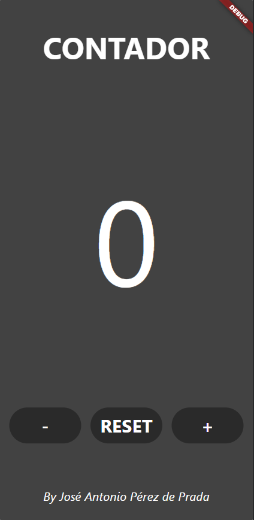
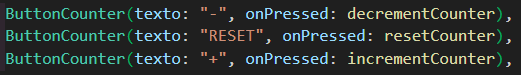
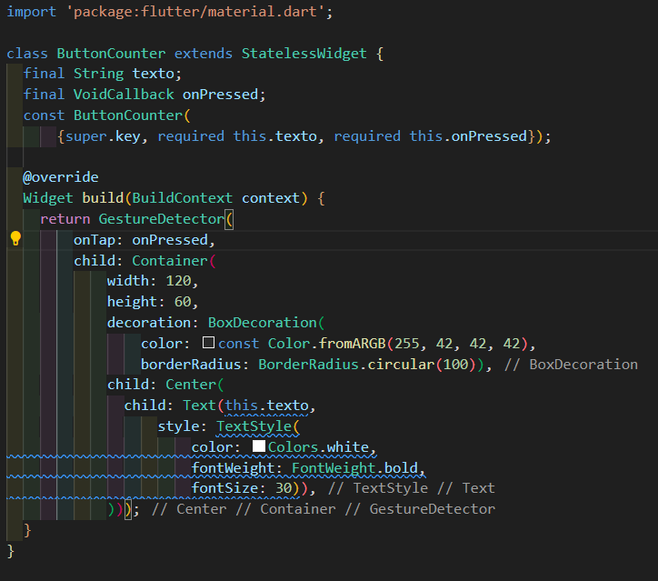
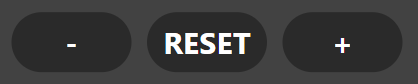
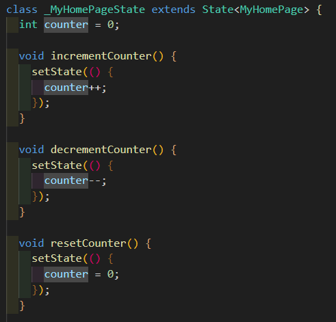

# FLUTTER

# Ejercicio 3

- **Autor**: José Antonio Pérez de Prada
- **Asignatura**: Acceso a Datos

## Enunciado

- Deberás de crear una clase en flutter que sea una plantilla de los botones, en la que le pases el argumento de texto y sustituirlo por los 3 botones que tenemos → 2 puntos
- Darle funcionalidad a los botones, cambios solo por consola → 2 puntos
- Cambios por pantalla → 4 puntos.
- README → 2 puntos.

## Resultado

Utilizando como base la aplicación creada en el ejercicio 2, se han modificado los ElevatedButton por ButtonCounter.

ButtonCounter es un widget creado en el archivo button.dart, cuyo contenido es el siguiente:

Como se puede observar en la captura, el widget cuenta con dos parámetros: **texto** y **onPressed** (siendo esta última una variable de tipo *VoidCallback*). Debajo de estos dos parámetros tenemos el constructor de la clase **ButtonCounter** y luego el método encargado de construir la estructura del widget. Con el obtenemos cada uno de estos botones:

Cada botón tiene su propio evento. **decrementCounter** hace que la variable **counter** de la principal disminuya, **resetCounter** que vuelva a ser 0 y **incrementeCounter** que aumente según el siguiente trozo de código.

